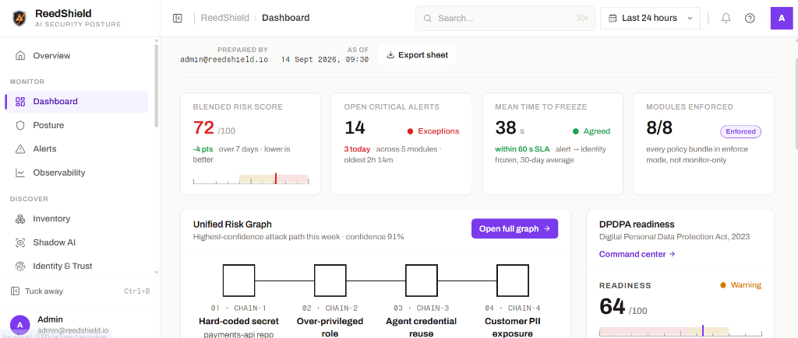
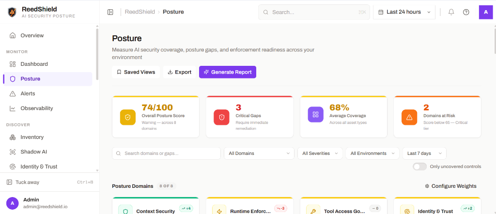
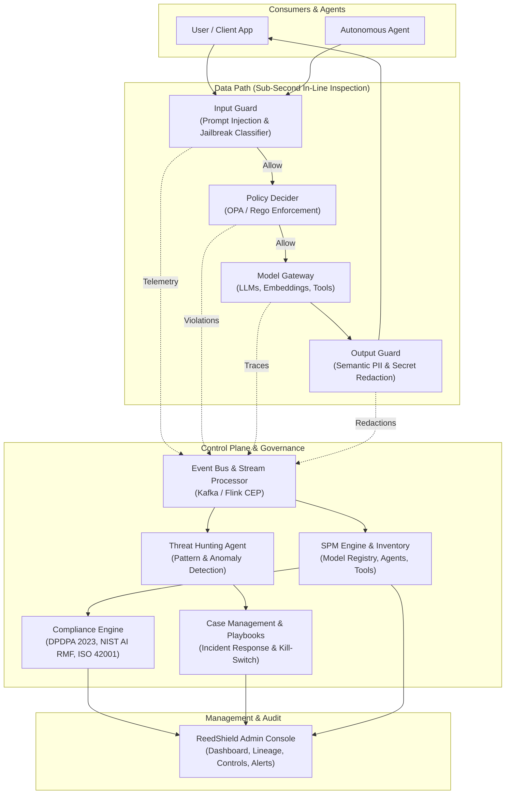

# Scapia AI-SPM — AI Security Posture Management

> **Scapia AI-SPM** is an enterprise AI security posture management and governance control plane designed to discover, secure, monitor, and defend artificial intelligence (AI) and machine learning (ML) systems. It delivers continuous real-time visibility into shadow AI, enforces sub-second runtime guardrails across autonomous agents and LLMs, validates defenses via automated red-teaming, and tracks regulatory compliance across global standards and India's Digital Personal Data Protection Act (DPDPA 2023).

---

[](https://opensource.org/licenses/Apache-2.0)


[](https://www.bestpractices.dev/projects/12873)

<p align="center">
  
  <br>
  <strong>ReedShield — AI Security Posture Management</strong>
</p>

---

## 📸 Executive & Operational Dashboard

<div align="center">
  <h3>Operational & Blended Risk Dashboard (WP A-1)</h3>
  <p><i>Real-time executive visibility synthesizing risk across AI models, cloud infrastructure, identities, sensitive context flows, and regulatory compliance.</i></p>
  
</div>

<br>

<div align="center">
  <h3>AI Security Posture Assessment</h3>
  <p><i>Measure AI security coverage, posture gaps, domain health, and enforcement readiness across your enterprise environment.</i></p>
  
</div>

---

## 🏛️ System Architecture

Scapia AI-SPM operates a dual-layer architecture separating the **Data Path** (sub-second runtime guardrails, token classification, and stream filtering) from the **Control Plane** (complex event processing, threat hunting, policy decider, and compliance aggregators).



---

## 🧩 Comprehensive Module Guide & Use Cases

Scapia AI-SPM is built around a working-papers binder paradigm, structuring security, governance, and audit operations into dedicated functional modules:

### 1. Monitor Domain

#### 1.1 Executive Security Command Center (`/admin/overview`)
* **Purpose:** High-level executive cockpit providing instant situational awareness over the entire enterprise AI attack surface.
* **Core Use Cases:**
  * **Unified Posture Gauge:** Real-time composite score (0–100) benchmarked across Prevention, Visibility, and Governance.
  * **Critical Threat Feeds:** Triage top active threat vectors (prompt injection outbreaks, credential exfiltration, jailbreak patterns).
  * **Policy Coverage Index:** Monitor percentage of deployed AI agents and models actively governed by OPA policy bundles.
  * **Rapid Launchpad:** Direct 1-click jump points to the Simulation Lab, Inventory, Alerts, and Case Management.

#### 1.2 Blended Risk Dashboard (`/admin/dashboard`)
* **Purpose:** Audit-grade working-paper sheet (`WP A-1 Dashboard`) detailing operational risk, response times, and enforcement status.
* **Core Use Cases:**
  * **Trial-Balance Metrics:** Tracks Blended Risk Score, Open Critical Alerts, and Mean Time to Freeze (MTTF SLA < 60s).
  * **Unified Risk Graph (`WP G-2`):** Traces 4-stage cross-domain kill chains (`SEC → IAM → AI → PII`) to visualize blast radius.
  * **DPDPA Readiness Widget (`WP H-1`):** Live statutory compliance index and emergency breach countdown status.
  * **Module Health & Enforcement:** Verifies that all 8 platform policy bundles are in active `ENFORCED` mode with signed Rules of Engagement (ROE).

#### 1.3 AI Security Posture Management (`/admin/posture`)
* **Purpose:** In-depth evaluation of enterprise security coverage, asset visibility gaps, and enforcement readiness.
* **Core Use Cases:**
  * **Asset Class Breakdown:** Assesses coverage density across Agents, Tools, Knowledge Bases, Identities, and Simulation Flows.
  * **Posture Drift Detection:** Flags newly introduced or unconfigured AI assets that lack boundary guardrails.
  * **Pillar Benchmarking:** Categorizes posture into Prevention, Visibility, and Governance with automated gap-closure recommendations.

#### 1.4 AI Threat Hunting & Alerts (`/admin/alerts`)
* **Purpose:** Threat intelligence and anomaly detection engine powered by stream processing and autonomous hunting agents.
* **Core Use Cases:**
  * **Real-time Alert Triage:** Filter findings by Severity (Critical, High, Medium, Low) and Status (Open, Investigating, Resolved).
  * **Forensic Evidence Inspection:** Inspect rule violations, prompt payload evidence, and full model decision traces.
  * **Case Escalation:** One-click escalation of active security alerts into formal investigation cases (`/admin/cases`).

---

### 2. Discover Domain

#### 2.1 AI Asset Inventory (`/admin/inventory`)
* **Purpose:** Comprehensive source of truth for all artificial intelligence assets operating across the organization.
* **Core Use Cases:**
  * **Multi-Asset Cataloging:** Discovers and registers proprietary models, external LLM endpoints (OpenAI, Anthropic, Bedrock), autonomous agents, MCP (Model Context Protocol) servers, and data connectors.
  * **Granular Asset Inspection:** Drawer inspection of ownership, runtime state, linked policies, and historical security violations.
  * **Isolated Agent Sandboxing:** Right-click custom agents to open a dedicated, sandboxed test conversation (`/agent/:id/chat`).
  * **Audit Export:** One-click JSON/CSV export of full asset inventory for risk and compliance audits.

#### 2.2 Shadow AI Discovery (`/admin/shadow-ai`)
* **Purpose:** Identify unsanctioned, unmanaged, or rogue AI usage within the corporate boundary.
* **Core Use Cases:**
  * **Unvetted Endpoint Detection:** Flags direct employee or internal service connections to unauthorized external AI APIs.
  * **Rogue Agent Identification:** Discovers unauthorized developer agents running outside centralized policy controls.
  * **Supply Chain Ingestion Monitoring:** Identifies unvetted HuggingFace weights or open-source checkpoints introduced into dev environments.

#### 2.3 Identity & Machine Trust (`/admin/identity` & `/admin/machine-identities`)
* **Purpose:** Zero-trust identity and access management tailored for autonomous AI agents and machine principals.
* **Core Use Cases:**
  * **Agent Credential Governance:** Tracks service accounts, delegated scopes, API keys, and ephemeral bearer tokens.
  * **Privilege Over-Granting Detection:** Highlights agents possessing unnecessary database write or cloud execution permissions.
  * **Instant Kill-Switch Freeze:** Freeze compromised agents or identities in under 60 seconds with an immutable audit trail.

#### 2.4 Data & Knowledge Trust Posture (`/admin/data`)
* **Purpose:** Safeguard retrieval-augmented generation (RAG) pipelines, vector stores, and enterprise knowledge sources.
* **Core Use Cases:**
  * **Sensitivity Classification:** Classifies RAG document stores into Public, Internal, Confidential, and Restricted.
  * **Data Poisoning Prevention:** Audits context source integrity and validates connector authentication credentials.
  * **PII/PHI Ingestion Guardrails:** Prevents unauthorized personal or proprietary documents from entering prompt context pipelines.

---

### 3. Protect Domain

#### 3.1 Runtime Guardrails & Live Stream Inspection (`/admin/runtime`)
* **Purpose:** Inline sub-second inspection of incoming user prompts, agent thoughts, tool invocations, and outgoing LLM completions.
* **Core Use Cases:**
  * **Two-Tier Threshold Scoring:**
    * Score `< 0.30`: Automatically Allowed.
    * Score `0.30 – 0.70`: Escalated for review / high-audit mode.
    * Score `>= 0.70`: Immediately Blocked at network boundary.
  * **Live Event Stream:** Chronological timeline showing guard model scoring, OPA Rego policy evaluation, and tool input/output parsing.
  * **Session Escalation:** Escalate suspicious ongoing conversational sessions directly to incident response teams.

#### 3.2 Policy Decider & OPA Governance (`/admin/policies`)
* **Purpose:** Enterprise Open Policy Agent (OPA) management engine providing declarative, version-controlled Rego policy bundles.
* **Core Use Cases:**
  * **Policy Lifecycle Management:** Transition bundles between `Draft`, `Monitor` (dry-run audit), and `Enforce` (live blocking).
  * **Inline Policy Editor:** Review and adjust policy code, scope definitions, and severity thresholds directly from the UI.
  * **Violation Telemetry:** Track today's violations per policy to calibrate rules and eliminate false positives.

#### 3.3 Context Flow & Data Lineage (`/admin/lineage`)
* **Purpose:** Directed Acyclic Graph (DAG) reconstructing how context flowed into every automated decision.
* **Core Use Cases:**
  * **Session Lineage Tracing:** Visually maps: `User Prompt → RAG Context Ingestion → Guard Evaluation → Tool Execution → Final Output`.
  * **Forensic Root Cause Analysis:** Drill down into specific decision nodes during security triage to inspect raw headers and payloads.
  * **Regulatory Explainability:** Satisfies EU AI Act and regulatory audits demanding verifiable proof of AI reasoning pathways.

---

### 4. Validate Domain

#### 4.1 Offensive Security & Simulation Lab (`/admin/simulation`)
* **Purpose:** Automated red-teaming lab testing the live defense pipeline against active adversarial vectors.
* **Core Use Cases:**
  * **Pre-Packaged Attack Suites:** Run automated attacks simulating Direct Prompt Injection, Indirect Injection, Jailbreaking, Secret Exfiltration, and Tool Manipulation.
  * **Garak Red-Teaming Integration:** Execute extensive adversarial probe families to stress-test prompt defenses.
  * **Empirical Validation:** Produces concrete defense pass/fail rates used as auditable proof rather than theoretical claims.

#### 4.2 Incident Response & Case Management (`/admin/cases`)
* **Purpose:** Centralized incident handling interface specifically architected for AI-related security events.
* **Core Use Cases:**
  * **Case Lifecycle Tracking:** Manage incident workflow across `Open`, `Investigating`, `Escalated`, `Awaiting Review`, and `Resolved`.
  * **Integrated Investigation:** Binds related sessions, lineage graphs, alert payloads, and remediation action checklists.
  * **SOC Collaboration:** Assign cases to security analysts and maintain timestamped case notes and evidence logs.

#### 4.3 Security Playbooks & Response Automation (`/admin/automation`)
* **Purpose:** Event-driven SOAR playbooks that trigger automatic countermeasures upon detected threats.
* **Core Use Cases:**
  * **Automated Isolation:** Automatically freeze compromised agent tokens upon detecting data exfiltration attempts.
  * **Adaptive Throttling:** Restrict RPM and burst limits for client tenants exhibiting high intent drift or repeated jailbreaks.
  * **Human-in-the-Loop Safeguards:** Requires explicit manual confirmation for destructive actions touching production-tagged assets.

---

### 5. Comply Domain: DPDP Act (2023) Compliance Center (`/admin/dpdp`)

Scapia AI-SPM delivers a dedicated compliance binder for India's **Digital Personal Data Protection Act, 2023**:

#### 5.1 DPDP Command Center (`/admin/dpdp/command-center`)
* **Purpose:** High-level dashboard for the Data Protection Officer (DPO) and compliance counsel.
* **Core Use Cases:**
  * **Weighted Readiness Score:** Aggregates compliance across statutory sections (bands at <55 Critical, 55–80 Warning, >80 Healthy).
  * **Critical Gap Highlighting:** Surfaced non-compliant AI pipelines with mapped statutory penalty tier references.

#### 5.2 Statutory Controls Register (`/admin/dpdp/controls`)
* **Purpose:** Section-by-section audit register covering **Sections 4 through 18** of the DPDP Act.
* **Core Use Cases:**
  * **Obligation Mapping:** Audits Lawful Processing (S.4), Notice Delivery (S.5), Valid Consent (S.6), Reasonable Security Safeguards (S.8(5)), and Personal Data Erasure (S.8(7)).
  * **Evidence Linking:** Inspect linked technical evidence items validating that an AI system adheres to statutory requirements.

#### 5.3 Non-Compliance Findings & Remediation (`/admin/dpdp/findings`)
* **Purpose:** Audit ledger managing DPDPA violations and technical exceptions.
* **Core Use Cases:**
  * **Remediation Workflows:** Track step-by-step remediation checklists from `DETECTED` to `IN PROGRESS` to `RESOLVED`.
  * **Formal Risk Acceptance:** Explicitly record legal risk acceptance with documented rationale and counsel sign-off.

#### 5.4 Consent & Data Principal Rights (`/admin/dpdp/rights`)
* **Purpose:** Governance over Data Principal consent records and statutory rights fulfillment.
* **Core Use Cases:**
  * **Rights Fulfillment SLAs:** Tracks incoming Data Principal requests for Right to Access (S.11), Correction & Erasure (S.12), Grievance Redressal (S.13), and Nomination (S.14).
  * **Consent Withdrawal Tracking:** Measures median hours to honor consent withdrawal across all active LLM retrieval stores.

#### 5.5 Emergency Breach Clock (`/admin/dpdp/breach-clock`)
* **Purpose:** High-priority incident notification countdown manager for personal data breaches.
* **Core Use Cases:**
  * **Mandatory Deadlines:**
    * **CERT-In Reporting:** Strict **6-Hour** notification window.
    * **Data Protection Board (DPB) Reporting:** Strict **72-Hour** notification window.
    * **Affected Data Principals:** Notification without undue delay.
  * **Live Incident Management:** Declare active breaches, track elapsed time, verify notification proofs, and log post-incident closure drills.

#### 5.6 Cross-Border Transfer Register (`/admin/dpdp/transfers`)
* **Purpose:** Register and audit international data transfers under Section 16 of the DPDP Act.
* **Core Use Cases:**
  * **Processor & Route Tracking:** Audits external cloud processors, transit routes, data categories, and contractual safeguards.
  * **Restricted Territory Verification:** Flags any transfer lacking recorded legal basis or routing through blacklisted jurisdictions.

---

### 6. Regulatory & Industry Frameworks (`/admin/frameworks`)
* **Purpose:** Harmonized multi-framework compliance mapping across international AI governance standards.
* **Core Use Cases:**
  * **NIST AI RMF:** Maps controls to GOVERN, MAP, MEASURE, and MANAGE functions.
  * **ISO/IEC 42001:** Provides audit evidence for Artificial Intelligence Management Systems (AIMS).
  * **OWASP Top 10 for LLMs:** Built-in telemetry detecting LLM01 (Prompt Injection) through LLM10 (Unbounded Consumption).
  * **EU AI Act & MITRE ATLAS:** High-risk AI system conformity documentation and adversary tactic mapping.

---

### 7. Platform & Operations Domain

#### 7.1 Ecosystem Integrations (`/admin/integrations`)
* **Purpose:** Enterprise connectivity hub linking Scapia AI-SPM with existing security, cloud, and AI stacks.
* **Core Use Cases:**
  * Connect to Identity Providers (Keycloak, Okta, Azure AD).
  * Forward security events to SIEM/SOAR (Splunk, Elastic, Datadog, Sentinel).
  * Connect LLM providers (OpenAI, Anthropic, AWS Bedrock, Groq, Ollama) and vector databases.

#### 7.2 Platform Administration & RBAC (`/admin/settings`)
* **Purpose:** Centralized system settings and Role-Based Access Control configuration.
* **Core Use Cases:**
  * **Role Matrix Enforcement:** Enforce granular permissions across `Admin`, `Security Analyst`, `Auditor`, and `Viewer`.
  * **Alert Notification Routing:** Configure webhooks and channel routing for critical security events.

#### 7.3 Interactive Secure Chat Surface (`/`)
* **Purpose:** User-facing conversational portal demonstrating real-time runtime protection.
* **Core Use Cases:**
  * Interactive LLM chat with dual-pass input/output guardrails.
  * Real-time explainability badges displaying guard decisions and policy verdicts under each completion.

---

## 🔒 Security, Credentials & Secret Protection

> [!IMPORTANT]
> **Zero Secrets in Source Control:**
> All private credentials, API tokens, encryption keys, and environment variables are strictly excluded from git tracking.
>
> - `**/.env`, `**/.env.*` (except `.env.example`) are ignored via [`.gitignore`](.gitignore).
> - All private keys and certificates (`keys/`, `*.pem`, `*.key`, `*.crt`) are strictly ignored.
> - All persistent database storage and volume bind-mounts (`DataVolumes/`, `*.db`, `*.sqlite`) are ignored.
> - A sanitized [`.env.example`](.env.example) template is provided with all keys left blank for secure deployment.

### Safe Initial Setup:
```bash
# 1. Create your local environment file from the sanitized template
cp .env.example .env

# 2. Populate your local secrets (API keys, database passwords) in .env
# Never commit your .env file!
```

---

## 🚀 Quick Start Guide

### Option 1: Running the UI Locally (Instant Preview)

```bash
# 1. Navigate to the UI directory
cd ui

# 2. Install dependencies (if not already installed)
npm install

# 3. Start the Vite development server
npm run dev
```

* **Local URL:** `http://localhost:3005/`
* **Default Admin Account:** `admin` / `admin`

---

### Option 2: Full-Stack Docker Deployment

```bash
# 1. Ensure Docker Desktop is running
docker compose version

# 2. Copy and configure environment variables
cp .env.example .env

# 3. Start core infrastructure (DB, Kafka, Redis, OPA)
docker compose -f compose.yml -f compose.local.yml --env-file .env up -d spm-db kafka-1 redis opa

# 4. Start authentication services (Keycloak, Traefik)
docker compose -f compose.auth.yml up -d

# 5. Start application microservices & UI
docker compose -f compose.yml -f compose.local.yml --env-file .env up -d guard-model api spm-api model-security garak-runner agent-orchestrator ui
```

---

## 📁 Repository Structure

```
├── ui/                  # Frontend single-page application (React 18 + Vite + TailwindCSS)
├── services/            # Microservices (FastAPI, Python 3.11)
│   ├── api/                     # CPM API gateway & streaming endpoints
│   ├── spm_api/                 # AI-SPM posture, inventory, and model registry
│   ├── guard_model/             # Sub-second prompt injection & safety classifier
│   ├── output_guard/            # Secondary semantic response validator
│   ├── policy_decider/          # Real-time OPA Rego policy evaluator
│   ├── policy_simulator/        # Interactive policy simulation engine
│   ├── threat-hunting-agent/    # Continuous background threat hunt agent
│   ├── agent-orchestrator-service/ # Agent lifecycle and execution coordinator
│   ├── garak/                   # Adversarial LLM vulnerability scanner runner
│   ├── memory_service/          # Short and long-term agent session memory
│   └── freeze_controller/       # Machine identity & agent kill-switch controller
├── spm/                 # Framework definitions (NIST, ISO, OWASP, DPDPA)
├── opa/                 # Open Policy Agent Rego rules and bundles
├── docs/                # Architecture diagrams, screenshots, and runbooks
├── deploy/              # Kubernetes Helm charts and deployment scripts
├── compose.yml          # Primary Docker Compose orchestration file
└── .env.example         # Sanitized configuration template (all secrets blank)
```

---

## 📜 License

Licensed under the **Apache License 2.0**. See [`LICENSE`](LICENSE) for details.
